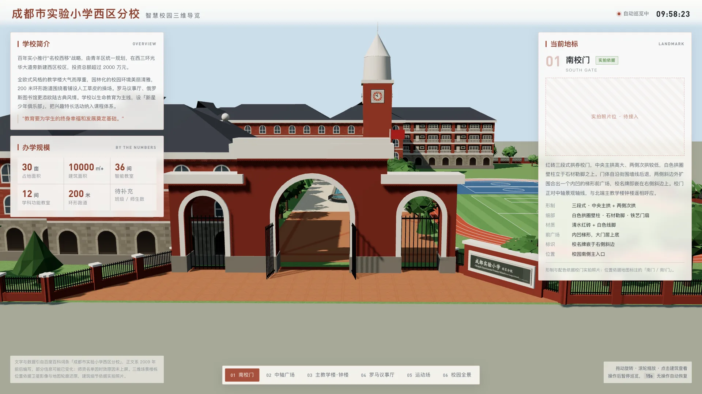

# 零素材、纯代码：用 Three.js 还原一所真实小学的三维校园大屏



## 前言

最近做了一个大屏 demo：用 Three.js 把一所真实存在的小学——成都市实验小学西区分校——还原成可交互的三维校园，放在大屏上自动巡览。

这个项目有一个比较"轴"的约束：**不用任何外部素材**。没有 GLB 模型、没有贴图图片、没有全景照片，楼体、砖墙、拱窗、钟面、校名牌、喷泉、树木，全部用代码在运行时生成。整个页面约 4600 行代码，打包进去的三维资源体积是 0。

这篇文章会聊聊：

- 怎么从一张卫星图出发，把校园总平面"量"成三维坐标
- 怎么用 Canvas 程序化画出红砖、拱窗、外廊、钟面这些贴图
- 校门拱券、三层叠盘喷泉、实时走动的钟楼指针分别怎么建模
- 大屏无人值守场景下的自动巡览怎么设计
- 一路踩过的坑——有几个坑相当隐蔽，值得单独拿出来说

技术栈：**Vue 3 + Vite + Three.js r186**。

---

## 一、效果与功能

先看效果。页面是一个 1920×1080 的大屏，三维校园铺满全屏，左右两侧浮着信息面板：


功能上主要有这几块：

| 功能 | 说明 |
|---|---|
| 三维校园 | 8 栋楼 + 钟楼 + 八边形议事厅 + 三段式校门 + 200 米跑道运动场 + 中轴喷泉广场 |
| 自动巡览 | 镜头按 6 个地标依次飞行、停靠，右侧面板同步切换介绍 |
| 随时接管 | 拖拽旋转、滚轮缩放即暂停巡览，空闲 15 秒后自动恢复 |
| 点击建筑 | 射线拾取，点哪栋楼就飞到哪个地标 |
| 实时钟楼 | 钟楼四面表盘的指针跟随系统时间走动 |
| 动态水景 | 三层叠盘喷泉，每股落水都在起伏 |

六个导览站分别是：南校门 → 中轴广场 → 主教学楼·钟楼 → 罗马议事厅 → 运动场 → 校园全景。

---

## 二、技术选型：为什么是"程序化建模"

动手之前手里的素材是这些：

- 两张正射/斜视卫星图
- 两张百度地图的矢量建筑轮廓
- 几张校门、教学楼、喷泉的实拍照片
- 一个百度百科词条

能走的路其实就三条：

| 方案 | 前提 | 结论 |
|---|---|---|
| 加载 GLB 模型 | 得有人建好模型 | ❌ 没有模型 |
| 全景图漫游 | 得有实拍全景照片 | ❌ 没有全景 |
| **程序化建模** | 有平面依据 + 立面照片 | ✅ 正好对上 |

而程序化建模恰好最适合这组素材：**卫星图提供"位置"，照片提供"长相"**。楼栋放在哪是有据可查的，楼长什么样参照照片还原。

另外两个设计决策：

**1. 中保真，不追求逐砖逐窗。** 普通楼栋做成"体块 + 坡屋顶 + 立面贴图"；校门、钟楼、喷泉、八边形楼这几个辨识度最高的地标单独精建。在大屏 40~250 米的观看距离上，决定"像不像"的是轮廓和配色，不是细节。

**2. 写实白天，而不是科技蓝。** 大屏项目很容易默认上深蓝科技风，但这所学校最大的辨识度是**清水红砖 + 白色拱窗 + 灰色坡屋顶**的英式学院风。科技蓝会把这个特征抹掉，所以配色直接取自实拍照片：

```js
// 砖红：取自教学楼外墙；线脚白：拱券、山花、钟楼；屋顶深灰蓝
brick: "#A6503C",  brickDeep: "#8C3F2E",  trim: "#F7F3EC",  roof: "#3B434F"
```

---

## 三、整体架构：三维逻辑与 Vue 彻底解耦

```
src/views/school/
├── index.vue              页面外壳：布局、取数、事件转接
├── components/            纯展示组件（标题栏、简介、指标、地标面板、导览栏）
├── data/schoolData.js     文案 / 指标 / 地标 / 机位；fetchSchoolData() 是换接口的接缝
└── scene/                 三维逻辑，不含任何 Vue 依赖
    ├── layout.js          校园总平面常量（唯一数据源）
    ├── textures.js        Canvas 程序化贴图
    ├── materials.js       共享材质 + 立面材质缓存
    ├── geometry.js        四坡屋顶 / 跑道轮廓 / 实例化等几何工具
    ├── buildings.js       常规楼栋
    ├── landmarks.js       钟楼 / 八边形楼 / 校门 / 校名牌
    ├── plaza.js           中轴广场与三层喷泉
    ├── playground.js      运动场
    ├── vegetation.js      绿化
    ├── fence.js           铁艺围栏
    ├── cameraTour.js      巡览状态机 + 轨道控制
    ├── picking.js         射线拾取
    └── SchoolScene.js     总装、渲染循环、资源释放
```

核心原则是：**`scene/` 目录不 import 任何 Vue 的东西**。Vue 组件只做三件事——挂载 canvas、传入数据、接收回调：

```js
scene = new SchoolScene({
  canvas: canvasRef.value,
  container: pageRef.value,
  landmarks: data.landmarks,
  onStopChange: (index) => (current.value = index),   // 巡览到哪站，面板就切到哪站
  onPlayingChange: (value) => (playing.value = value) // 巡览 / 人工接管 状态
})
```

这样做的好处：三维逻辑可以单独调试；`index.vue` 不会膨胀成几千行；以后要把场景搬到别的框架，`scene/` 整个拷走即可。

另外有个小细节：场景实例**不要做成响应式**。`SchoolScene` 内部持有大量 WebGL 对象，被 Vue 的 Proxy 包一层既没意义又费性能，用普通变量 `let scene = null` 存就行。

---

## 四、从卫星图到三维坐标

### 4.1 标定比例尺

卫星图是像素，三维场景要的是米。第一步是标定比例尺：以建筑轮廓为参照，量出约 **8.73 px/m**，于是：

```js
// 坐标系：米制，X 向东、Z 向南、Y 向上，原点在校园几何中心
X = (px - 717.5) / 8.73
Z = (py - 737.5) / 8.73
```

据此量得用地 **130m（东西）× 152m（南北）= 19760 ㎡ ≈ 29.6 亩**。

怎么知道标得对不对？拿外部数据交叉验证：百科记载这所学校**占地 30 亩**。29.6 vs 30，吻合。

### 4.2 一个代价很大的错误

说个教训。第一版我**没做这一步**，而是凭"30 亩"倒推了一个 148m × 130m 的用地——面积也对，但**长宽比是反的**：实际校园南北比东西长，我做成了东西比南北长。

底图比例错了，上面所有楼栋就跟着整体错位。直到拿渲染图和卫星图并排对比，才发现"建筑排列根本对不上"，最后整个总平面推倒重来，六个巡览机位全部重算。

> **只用面积反推尺寸是不够的，面积对了不代表形状对了。** 一定要从图上直接量，再拿面积去验证。

### 4.3 把布局写成唯一数据源

所有坐标集中在 `layout.js`，其他模块只读不写：

```js
export const BUILDINGS = [
  { x: -41, z: -61, w: 32, d: 14, floors: 4, name: "北侧西楼", corridor: ["+z"] },
  { x: 0,   z: -35, w: 20, d: 30, floors: 4, name: "主教学楼" },
  // ...
]
export const FIELD = { x: 34, z: 20, trackOuterHalfW: 24, trackOuterHalfL: 43, ... }
export const PLAZA = { x: -4, z: 4, poolW: 7.5, poolD: 20, ... }
```

这样改一栋楼的位置只动一处，树木避让、机位计算这些依赖它的逻辑会自动跟上。

---

## 五、Canvas 程序化贴图：一张图片都不用

"零素材"的关键在贴图。砖墙、拱窗、石材、跑道、校名牌、钟面、池底马赛克，全部是运行时用 Canvas 2D 画出来，再包成 `CanvasTexture`。

### 5.1 一张贴图 = 一个开间

立面贴图的设计思路是：**一张图只画一个开间**（约 4.2m 宽 × 一层楼高），然后按楼宽和层数重复平铺：

```js
function buildFacadeCanvas() {
  const c = createCanvas(140, 120)
  const g = c.getContext("2d")
  paintBrick(g, 140, 120)        // 红砖底 + 错缝砖缝 + 随机深浅

  // 白色窗套：下方矩形 + 上方半圆拱
  g.fillStyle = "#F7F3EC"
  g.beginPath()
  g.moveTo(wx - 5, wy + wh + 5)
  g.lineTo(wx - 5, wy + r)
  g.arc(wx + r, wy + r, r + 5, Math.PI, 0)   // 拱顶
  g.lineTo(wx + ww + 5, wy + wh + 5)
  g.fill()
  // ... 再画玻璃、窗格、楼层腰线
}
```

砖面那一步有个小技巧：**每块砖随机叠一层极淡的黑或白**（透明度 0~5%），整面墙立刻就不是塑料感的纯色了。

### 5.2 三种立面，按面选用

对照实拍照片会发现，教学楼不是每一面都一样：

- **首层**：灰色粗琢石材砌的**连续拱廊**（过道），和上部红砖形成材质对比
- **上层临院一侧**：**开敞外廊**——砖柱 + 白色栏杆 + 凹进去的教室门与窗
- **上层其余面**：**拱窗墙**

所以楼身拆成"首层 + 以上楼层"两段，每段用 `BoxGeometry` 的**材质数组**给六个面分别指定贴图（顺序是 `+X, -X, +Y, -Y, +Z, -Z`）：

```js
const faceMaterial = (face, faceWidth) =>
  corridorFaces.includes(face)
    ? materials.getCorridor(faceWidth, upperFloors)  // 外廊
    : materials.getFacade(faceWidth, upperFloors)    // 拱窗

const upper = new Mesh(new BoxGeometry(w, upperHeight, d), [
  faceMaterial("+x", d), faceMaterial("-x", d),
  materials.stone, materials.stone,                  // 顶面、底面
  faceMaterial("+z", w), faceMaterial("-z", w)
])
```

注意 X 向两面按**进深** `d` 取重复次数，Z 向两面按**面宽** `w` 取——如果都用同一个重复次数，短边的窗户会被横向拉扁。

### 5.3 外廊：一张图是"一间教室"，不是"一个开间"

外廊贴图最初也是"一个开间一扇门"，结果 45 米长的楼一层排出十来扇门——等于一层十来间教室，明显不对。

后来改成**一张图 = 一间教室单元**：三个开间宽（约 11m），第一间画教室门和门边亮子，后两间画教室窗。重复次数按每层教室数算，并且封顶：

```js
const CLASSROOM_WIDTH = 11   // 一间教室约 11 米
const MAX_CLASSROOMS = 4     // 每层最多 4 间

materials.classroomUnits = (widthMeters) =>
  Math.min(MAX_CLASSROOMS, Math.max(1, Math.round(widthMeters / CLASSROOM_WIDTH)))
```

再长的楼也不会一层排出十几间教室，而是把每间摊宽。同时首层拱廊的拱数改为"教室数 × 3"，保证上下层的柱子和拱券**竖向对齐**。

### 5.4 校名牌：把文字画进贴图

校门旁边的校名牌是参照近照还原的：深灰绿石材拼板、白色石框、阴刻书法字。

阴刻效果用了个简单的办法——**先画一层暗色偏移，再压一层亮色**，模拟字口的受光面：

```js
const engrave = (text, font, x, y, light) => {
  g.font = font
  g.fillStyle = "rgba(0,0,0,.45)"
  g.fillText(text, x + 2, y + 2)   // 字口阴影
  g.fillStyle = light
  g.fillText(text, x, y)           // 受光面
}
engrave("成都实验小学", `700 74px ${kaiti}`, 96, 82, "#E4EAE5")
engrave("西区分校",     `700 44px ${kaiti}`, 560, 92, "#D3DAD5")
```

字体用楷体栈 `"STKaiti", "KaiTi SC", "Kaiti SC", "KaiTi", "SimSun", serif`，比黑体更接近牌面的书法字。

---

## 六、建筑建模

### 6.1 四坡屋顶：8 个顶点

坡屋顶是自定义几何：4 个檐角 + 2 个脊点，脊线沿长边：

```js
export function hipRoofGeometry(w, d, h) {
  const hw = w / 2, hd = d / 2
  const alongX = w >= d
  const inset = alongX ? hd : hw
  const ridgeA = alongX ? [-hw + inset, h, 0] : [0, h, -hd + inset]
  const ridgeB = alongX ? [ hw - inset, h, 0] : [0, h,  hd - inset]
  const eave = [[-hw, 0, -hd], [hw, 0, -hd], [hw, 0, hd], [-hw, 0, hd]]
  const tris = [
    [eave[0], eave[1], ridgeB], [eave[0], ridgeB, ridgeA],  // 前坡
    [eave[1], eave[2], ridgeB],                              // 右端坡
    [eave[2], eave[3], ridgeA], [eave[2], ridgeA, ridgeB],  // 后坡
    [eave[3], eave[0], ridgeA]                               // 左端坡
  ]
  // ... 写入 position，computeVertexNormals()
}
```

这里有个省事的处理：**不纠结三角形绕序**，材质直接设 `side: DoubleSide`。Three.js 的着色器会根据 `gl_FrontFacing` 自动翻转背面法线，所以坡面从哪个角度看受光都是对的。

### 6.2 南校门：用"洞"挖出拱券

校门是三段式：中央主门高、两侧次门低。拱券是**真实挖通**的，做法是 `Shape` + `holes` + `ExtrudeGeometry`：

```js
// 门洞轮廓：下部竖直、上部半圆
function makePortal(cx, width, spring, bottom, Ctor) {
  const half = width / 2
  const path = new Ctor()
  path.moveTo(cx - half, bottom)
  path.lineTo(cx - half, spring)
  for (let i = 1; i <= 20; i++) {
    const t = Math.PI - (Math.PI * i) / 20
    path.lineTo(cx + half * Math.cos(t), spring + half * Math.sin(t))
  }
  path.lineTo(cx + half, bottom)
  path.closePath()
  return path
}

// 砖墙 = 矩形挖去门洞
shape.holes.push(makePortal(cx, arch.width, arch.spring, 0, Path))
```

白色的**拱圈 + 壁柱**更有意思——用同一个函数造一个**大一圈的门洞轮廓，再把原门洞作为 hole 挖掉**，挤出来的就是一圈 U 形白边，一次成型：

```js
const trimShape = makePortal(cx, arch.width + trimWidth * 2, arch.spring, baseHeight, Shape)
trimShape.holes.push(makePortal(cx, arch.width, arch.spring, baseHeight, Path))
```

`makePortal` 的最后一个参数传 `Path` 还是 `Shape`，决定它是用来"挖洞"还是"当外轮廓"——一个函数两用。

校门前还有个细节：入口不是一条直线，而是一个**内凹的梯形前广场**——门体从沿街围墙后退 10 米，两条斜边外扩接回围墙，校名牌就嵌在右侧斜边上，面朝门前的人。


### 6.3 钟楼：指针跟着真实时间走

钟楼四面表盘的盘面是 Canvas 画的（英式塔钟样式：四角哥特花饰、60 格分钟石、砖红数字环、只写 XII/III/VI/IX 四个罗马数字），**指针则是真实的三维物体**。

每根指针挂在一个位于盘心的空 `Group` 上，转指针只改 `Group.rotation.z`，不用重建几何：

```js
export function updateClockTime(dials, date = new Date()) {
  const seconds = date.getSeconds() + date.getMilliseconds() / 1000
  const minutes = date.getMinutes() + seconds / 60
  const hours = (date.getHours() % 12) + minutes / 60

  const hourAngle = (hours / 12) * Math.PI * 2
  const minuteAngle = (minutes / 60) * Math.PI * 2

  dials.forEach((dial) => {
    // 钟面角度顺时针为正，而绕 +z 正向旋转在正面看是逆时针，所以取负
    dial.hour.rotation.z = -hourAngle
    dial.minute.rotation.z = -minuteAngle
  })
}
```

两个细节：**时针叠加分钟的零头、分针叠加秒的零头**，指针才是连续走而不是跳格；渲染循环里**每秒校一次**就够了，不必每帧取系统时间。


### 6.4 三层叠盘喷泉：LatheGeometry 车削

中轴广场的喷泉是这个项目里建模最细的部分，参照实景照片做成三层叠盘式样：基座 → 环绕石雕 → 大盘 → 中盘 → 小盘 → 顶饰。

**关键是 `LatheGeometry`**。古典喷泉本来就是石材车削件，用圆柱体堆叠永远做不出那种外张的曲线。用一张 `[半径, 高度]` 轮廓表车出回转体，形体就对了：

```js
const bowl1 = lathe([
  [0.66, 2.18], [0.95, 2.26], [1.32, 2.42], [1.66, 2.62],
  [1.88, 2.84], [1.98, 3.04],
  [2.06, 3.2],          // 外缘
  [2.06, 3.28],
  [1.96, 3.32],         // 口沿内翻
  [1.8, 3.24], [1.4, 3.08], [0.9, 2.98], [0.5, 2.96],
  [0, 2.96]             // 盘底封口
], stone, 96)
```

盘口的**扇贝花边**也不用在盘沿摆一圈小块，车削完之后按角度对半径做 cos 调制即可：

```js
function scallop(geo, lobes, amp, fromR, toR) {
  const pos = geo.attributes.position
  for (let i = 0; i < pos.count; i++) {
    const x = pos.getX(i), z = pos.getZ(i)
    const r = Math.hypot(x, z)
    if (r <= fromR) continue
    // 幅度从内圈的 0 平滑增大到最外缘，否则调制区边界会留一道硬接缝
    const t = Math.min(1, (r - fromR) / (toR - fromR))
    const k = 1 + amp * t * Math.cos(lobes * Math.atan2(z, x))
    pos.setX(i, x * k)
    pos.setZ(i, z * k)
  }
  geo.computeVertexNormals()
}
scallop(bowl1.geometry, 20, 0.035, 1.2, 2.06)   // 大盘 20 瓣
```

水做了三层：**池底马赛克（不透明）→ 水面（半透明）→ 落水水幕**。池水的蓝来自池底马赛克而不是水本身，这样才有通透感。

还有个讲究：每层盘沿垂下的水柱**股数等于扇贝瓣数**（20 / 16 / 12），每股都正对一个瓣尖——水本来就是从凸出的瓣尖淌下来的。


---

## 七、运动场

200 米跑道是"外轮廓挖去内轮廓"：

```js
const outer = stadiumShape(trackOuterHalfW, trackOuterHalfL)   // 直道 + 两端半圆
const inner = stadiumShape(trackInnerHalfW, trackInnerHalfL)
outer.holes.push(new Path(inner.getPoints(90)))
group.add(groundFromShape(outer, materials.track, Y_TRACK))
```

内场的草皮和北端的蓝色硬地球场，用了一个按跑道内圈**裁剪**的工具函数 `innerFieldShape`——给定一段 Z 区间，左右边界在弧段处按圆方程自动收窄：

```js
const widthAt = (z) => {
  const over = Math.abs(z) - straight          // 超出直道多少
  if (over <= 0) return halfW                  // 直道段：全宽
  const remain = halfW * halfW - over * over   // 弧段：按圆方程收窄
  return remain > 0 ? Math.sqrt(remain) : 0
}
```

如果内场直接用矩形，四个角会戳到跑道上。


---

## 八、绿化与围栏：InstancedMesh 是命根子

大屏要 7×24 常驻，draw call 必须压住。树木上百棵、围栏竖栅上千根，**全部走 `InstancedMesh`**，每种构件只占一次 draw call。

### 8.1 程序化树木

最初的树是"一个球加一根棍"，非常假。改进时先排除了两条路：

- **照片级树木**需要带 alpha 叶片卡的 GLB 模型，和"零素材"冲突
- **交叉 billboard 贴图树**（游戏里最常用）在俯视全景机位下会露出交叉平面，从正上方看就是一个"X"

所以还是走几何，靠三件事把观感拉上来：

**① 不规则树冠。** 在正二十面体上沿法向随机推拉顶点，破掉完美球面；一棵阔叶树由 4 团这样的不规则球叠成：

```js
function createCanopyGeometry(seed) {
  const geo = new IcosahedronGeometry(1, 1)
  const pos = geo.attributes.position
  const v = new Vector3()
  for (let i = 0; i < pos.count; i++) {
    v.fromBufferAttribute(pos, i)
    v.multiplyScalar(0.72 + rand(i, seed) * 0.5)   // 沿法向随机推拉
    pos.setXYZ(i, v.x, v.y * 0.88, v.z)            // 竖向略压扁
  }
  geo.computeVertexNormals()
  return geo
}
```

**② 逐棵随机**种类（阔叶 / 针叶 / 小乔木）、高矮、胖瘦、朝向。

**③ 逐棵颜色不同**——用 `instanceColor` 从五档绿色里取一档再做亮度微扰。

所有随机量都由下标推导，**不用 `Math.random()`**，保证每次刷新布局和配色完全一致：

```js
function rand(i, salt) {
  const v = Math.sin(i * 127.1 + salt * 311.7) * 43758.5453
  return v - Math.floor(v)
}
```

### 8.2 树木避让

行道树按固定间距批量排，必然会有若干棵落进楼体、跑道或校门前广场。统一用几何判断剔除：

```js
return spots.filter(([x, z]) =>
  !isInsideBuilding(x, z) && !isInsideOctagon(x, z) &&
  !isOnTrack(x, z) && !isInForecourt(x, z)
)
```

`isOnTrack` 同样要按圆方程处理两端半圆，当成矩形算会漏。

### 8.3 铁艺围栏

校园周界除了正大门，全部是**砖基座 + 等距砖柱 + 白色柱帽 + 黑色铁艺竖栅**。周长五百多米，立柱、柱帽、横档、竖栅各一个 `InstancedMesh`，总共 4 次 draw call 画完。

---

## 九、自动巡览：为无人值守设计

大屏大部分时间没人操作，所以交互设计成：**默认自动巡览，有人动就让出控制权，没人动了再接着巡。**

### 9.1 巡览状态机

三个状态：**飞行中 → 停靠中 → 人工接管**。

```js
update(dt) {
  if (this.flying) {
    // 飞行：位置和注视点同时插值，easeInOutCubic 起步收尾都平缓
    const k = Math.min(1, (this.flyProgress += dt / FLY_DURATION))
    const e = easeInOutCubic(k)
    const position = this.flyFrom.position.clone().lerp(this.flyTo.position, e)
    this.target.copy(this.flyFrom.target.clone().lerp(this.flyTo.target, e))
    this.spherical.setFromVector3(position.clone().sub(this.target))
    this.apply()
    if (k >= 1) this.flying = false
    return
  }
  if (this.playing) {
    // 停靠：极缓慢环绕，让画面不完全静止；到时间去下一站
    this.holdElapsed += dt
    this.spherical.theta += dt * 0.005
    this.apply()
    if (this.holdElapsed > HOLD_DURATION) this.gotoStop((this.current + 1) % n, false)
    return
  }
  // 人工接管：空闲超过 15 秒自动恢复
  this.idleElapsed += dt
  if (this.idleElapsed > IDLE_RESUME && !this.dragging) this.resume()
}
```

停靠时那一点点环绕（`theta += dt * 0.005`）很重要——完全静止的画面在大屏上会让人以为卡死了。但也不能太快，最初设成 0.016，停几秒就转离了预设机位。

### 9.2 为什么自己写轨道控制

没用 `OrbitControls`，而是自己写了约 50 行。原因是只需要"绕注视点旋转 + 缩放"两种行为，自写的好处是**和巡览状态机共用同一套球坐标** `Spherical`——巡览飞行和人工拖拽改的是同一组 `radius / phi / theta`，接管和恢复之间不会出现镜头跳变。

```js
apply() {
  const s = this.spherical
  s.phi = Math.max(PHI_MIN, Math.min(PHI_MAX, s.phi))            // 防止转到地底
  s.radius = Math.max(RADIUS_MIN, Math.min(RADIUS_MAX, s.radius))
  this.camera.position.copy(this.target).add(new Vector3().setFromSpherical(s))
  this.camera.lookAt(this.target)
}
```

### 9.3 点击建筑

射线拾取后**沿父级向上回溯**，找第一个带 `userData.stop` 的分组。楼栋是 Group 套 Mesh，点中的往往是某块墙面或屋顶，回溯到 Group 才知道它属于哪个地标：

```js
for (const hit of raycaster.intersectObjects(root.children, true)) {
  let node = hit.object
  while (node && node !== root) {
    if (typeof node.userData.stop === "number") return node.userData.stop
    node = node.parent
  }
}
```

---

## 十、大屏常驻的性能考量

| 措施 | 做法 |
|---|---|
| 材质复用 | 全场景共享一批材质实例；立面材质按"开间数_层数"缓存，相同规格复用 |
| 实例化 | 树木、围栏、铁艺门扇、喷泉石雕全部走 `InstancedMesh` |
| 像素比封顶 | `setPixelRatio(Math.min(devicePixelRatio, 1.5))`，大屏常是高分屏，不封顶填充率吃紧 |
| 后台停渲染 | 监听 `visibilitychange`，页面不可见时渲染循环直接 return |
| 完整释放 | 卸载时 `traverse` 释放所有几何体、统一释放材质和贴图、`renderer.dispose()` |

---

## 十一、踩坑合集

这部分可能是整篇里最有用的。按"隐蔽程度"排个序：

### 坑 1：`CylinderGeometry` 的 UV 是绕整圈的

八边形议事厅的窗户一度又宽又扁、严重变形。原因是：

- `BoxGeometry` **每个面**的 UV 各自是 0→1
- `CylinderGeometry` 侧面的 UV 是**绕整圈**走 0→1

我按单条边宽（9.18m）算出 3 个开间，结果这 3 个开间被摊到 8 个面、73 米周长上——每扇窗横向拉伸了 8 倍多。改成按**整圈周长**算重复次数就好了：

```js
const perimeter = 8 * 2 * radius * Math.sin(Math.PI / 8)   // 正八边形周长
materials.getFacade(perimeter, floors)
```

### 坑 2：`ShapeGeometry` 的 UV 等于米制坐标

`PlaneGeometry` 的 UV 是 0~1，`repeat = 26` 就是铺 26 块。但 `ShapeGeometry` 的 UV **直接等于形状坐标（米）**，同样 `repeat = 26` 变成每米 26 块，密到糊成一片。用在 ShapeGeometry 上的贴图，重复次数要按"每米几块"给。

### 坑 3：`instanceColor` 是乘法

`InstancedMesh.setColorAt()` 给的颜色会和**材质自身颜色相乘**。所以用到它的材质，基色必须设成白色。我给阔叶树传了颜色、**漏了针叶树**，结果那批树全渲染成了白色锥体。

### 坑 4：Z-fighting

蓝色球场和绿色草皮最初都铺在 `y = 0.06`，而且区域重叠了 6 米，重叠带出现大片闪烁锯齿。解决办法是**分层铺**——跑道 0.05、草皮 0.07、球场 0.09、划线 0.13，彼此不共面；草皮铺满整个内圈当底层，球场直接盖在上面。

### 坑 5：实心体块会"吞掉"水面

水池的池壁最初是一个实心 `BoxGeometry`，水面平面在它**内部**，画面上只剩一块石板。池壁必须做成**中空的四条边框**，水面才露得出来。圆池同理，用车削出"内壁 → 压顶 → 外壁"的剖面，而不是实心圆柱。

### 坑 6：Three.js r155+ 的灯光是物理量纲

从 r128 的原型迁移到 r186，同样的灯光强度画面明显偏暗。r155 之后灯光改成了物理量纲，旧版的强度大约要乘以 π 才等效。

### 坑 7：相机距离下限把近景机位推远了

为了防止用户缩放进楼体里，给轨道半径设了下限 38 米。结果校门机位的期望距离只有 24 米，被强行推远三倍，拱券缩成一条细带。下限要按**最近的那个预设机位**来定，最后改成了 16 米。

### 坑 8：贴图画布宽度要跟着开间宽度改

为了让窗户变稀，把开间宽度从 3 米放宽到 4.2 米。但如果**画布宽度不跟着同比例加宽**，同一张图铺到更宽的墙面上，窗户会被横向拉扁——和坑 1 是同一类问题。画布从 96px 加到 140px，多出的宽度全部变成窗间墙，窗才是"变稀"而不是"变扁"。

---

## 十二、关于"真实"：数据的处理原则

最后聊一个技术之外的点。这是一所真实的学校，大屏上的每一条信息都可能被当成事实。所以定了几条规矩：

1. **能查证的才上屏。** 面积、跑道长度、教室数量引自百科；百科词条正文写于 2009 年前后，师资名单这类时效性内容大概率已经变了，**直接不上屏**，以免写错真人。
2. **查不到的不编。** 班级数、师生数百科没有，界面显示"待补充"，不拿假数字凑满面板。
3. **推断的要标出来。** 那栋八边形楼叫"罗马议事厅"，是根据百科提到的名称 + 形制吻合推断的，没有校方确认。界面上用橙色"名称待确认"标签和其他有实拍依据的地标区分开。


做可视化很容易为了画面饱满去"补"数据。但大屏的观众没法分辨哪条是真的、哪条是凑的——**宁可留白，也别让它看起来比实际更确定。**

---

## 总结

回头看，这个项目最核心的几个思路：

- **素材决定技术路线**：有卫星图和照片、没有模型和全景，程序化建模是唯一正解
- **卫星图给位置、照片给长相**：位置要有据可查，细节参照实拍还原
- **中保真**：普通楼体块化，地标精建，把精力花在辨识度最高的地方
- **Canvas 贴图 + InstancedMesh**：零素材的关键，也是大屏常驻的性能底线
- **三维逻辑与框架解耦**：`scene/` 不依赖 Vue，可独立调试、可整体迁移

以及最重要的一条：**多拿渲染图和真实照片并排对比。** 文中好几个大问题（长宽比反了、校门形制不对、入口其实是梯形）都不是看代码能发现的，是并排一比才看出来的。

如果对某个部分的实现感兴趣，欢迎评论区交流 👋
